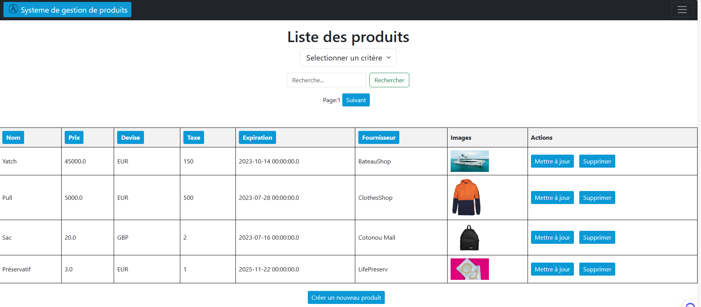
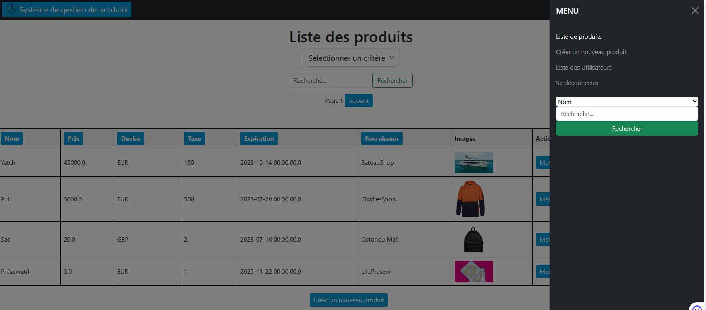
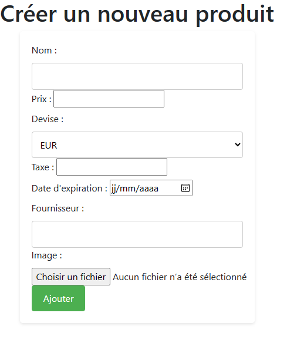

# Gestion de Produit - Projet Java Spring Boot

Ce dépôt GitHub contient le code source du projet "Gestion de Produit" réalisé avec Java Spring Boot. Ce projet a pour objectif de fournir une application de gestion de produits avec les opérations CRUD (Create, Read, Update, Delete). L'application utilise une base de données MySQL pour stocker les informations des produits et des utilisateurs.
Des mises à jour afin d'amméliorer le projet se feront.
## Structure du projet

L'arborescence du projet est la suivante :

```
Gestion_Produit/
├── src/
│   ├── main/
│   │   ├── java/
│   │   │   └── com/
│   │   │       └── asking/
│   │   │           └── api_produit/
│   │   │               ├── ApiProduitApplication.java
│   │   │               ├── controller/
│   │   │               │   ├── ProduitController.java
│   │   │               │   ├── SecConfiguration.java
│   │   │               │   ├── StatusErrorController.java
│   │   │               │   └── UserController.java
│   │   │               ├── modele/
│   │   │               │   ├── Produit.java
│   │   │               │   └── User.java
│   │   │               ├── repository/
│   │   │               │   ├── ProduitRepository.java
│   │   │               │   └── UserRepository.java
│   │   │               └── service/
│   │   │                   ├── CustomUserDetails.java
│   │   │                   ├── CustomUserDetailsService.java
│   │   │                   ├── ProduitService.java
│   │   │                   └── ProduitServiceImpl.java
│   │   └── resources/
│   │       ├── application.properties
│   │       ├── static/
│   │       │   ├── Images/
│   │       │   ├── js/
│   │       │   │   └── script.js
│   │       │   └── logo/
│   │       │       ├── logo.png
│   │       │       └── logo.svg
│   │       └── templates/
│   │           ├── create.html
│   │           ├── createUser.html
│   │           ├── error/
│   │           │   ├── 403.html
│   │           │   ├── 404.html
│   │           │   ├── 500.html
│   │           │   └── error.html
│   │           ├── index.html
│   │           ├── list.html
│   │           ├── register_success.html
│   │           ├── resultRecherche.html
│   │           ├── update.html
│   │           └── users.html

```

## Description du projet

Le projet "Gestion de Produit" est une application Spring Boot qui offre les fonctionnalités suivantes :

1. Gestion des produits : permet d'ajouter, de modifier et de supprimer des produits avec leurs informations.

2. Gestion des utilisateurs : permet d'ajouter, de modifier et de supprimer des utilisateurs avec leurs informations.

## Images

<div style="display: flex; justify-content: space-between;">
  
  
  
</div>

## Comment utiliser le projet

1. Clonez ce dépôt sur votre machine locale en utilisant la commande suivante :

```
git clone https://github.com/AsKing07/Java-SpringBoot-Gestion-de-produits.git
```

2. Assurez-vous d'avoir Java JDK, Maven et MySQL installés sur votre machine.

3. Modifiez les informations de connexion à la base de données dans le fichier `application.properties` situé dans le dossier `src/main/resources` pour correspondre à vos paramètres de configuration.

4. Exécutez la commande `mvn spring-boot:run` dans le répertoire du projet pour démarrer l'application Spring Boot.

5. Ouvrez un navigateur web et accédez à `http://localhost:8080/` pour démarrer l'application.

6. Utilisez les liens appropriés sur la page de la liste des produits pour créer, mettre à jour ou supprimer un produit.

## Contribuer

Si vous souhaitez contribuer à ce projet, vous pouvez effectuer une demande de fusion (pull request) en proposant vos modifications. Nous serons heureux d'examiner vos contributions.

## Auteurs

- [Charbel SONON](https://github.com/AsKing07) - Développeur principal

## Licence

Ce projet est sous licence [MIT](LICENSE), ce qui signifie que vous pouvez l'utiliser, le modifier et le distribuer librement. Cependant, veuillez noter que certaines parties du projet peuvent être soumises à d'autres licences.

Nous vous remercions de votre intérêt pour notre projet "Gestion de Produit" et nous espérons que cela vous sera utile. Si vous avez des questions ou des problèmes, n'hésitez pas à les soulever dans la section des problèmes (issues) du dépôt. Bon développement !
